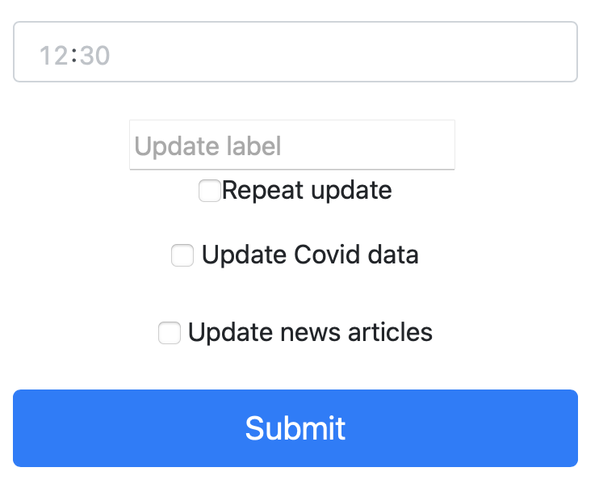
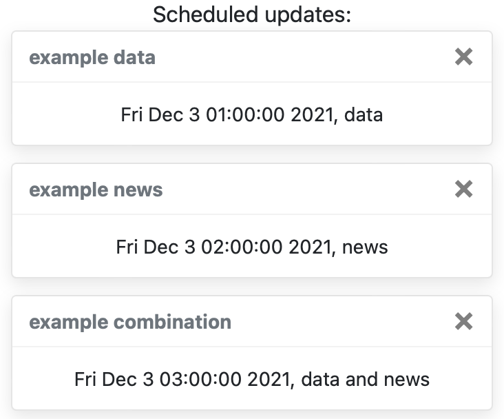
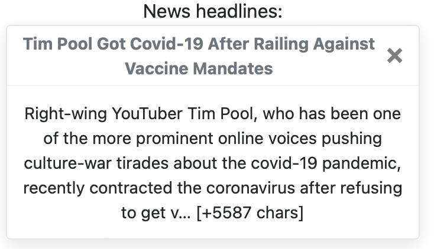

# COVID-19 Dashboard f

# Prerequisites or Instalation - either
- uk_covid19 module
- newsapi module
- Python sched module

## Introduction:
Creates a locally hosted webpage containing COVID-19 data and news:
- local last 7 days infection rate
- national last 7 days infection rate
- national current hospital cases
- national total deaths (from COVID-19)

## Prerequisites
- Python 3.10.0 64-bit

## Instalation
- `pip install x`

## Getting Started
- Run the program
    - There will be no visual confirmation that it is running successfully
- In a web browser go to http://127.0.0.1:5000/
- ### Adding update
    
    - Add the time of the update to the top input box (where it says '12:30')
    - Add the name of the update to the second input box (where it says 'Update label')
    - If you want the update to happen every 24-hour, check the 'Repeat update' box; if it is a one-off, leave it unchecked
    - Depending if you want to update the COVID-19 data or news, check the relevant boxes ('Update Covid data' or 'Update news articles')
        - If neither box is checked, the update will not be set
        - Both boxes can be checked at once, creating an update for the data and news uder the same name
        - New updates can't be set for the same time as scheduled updates
    - Press the 'Submit' button to create your new update
- ### Remove update
    
    - Click on the cross on the top right of an update to remove it
        - If you have a news and data update, like 'example combiation', there is no way to remove just the data or news update
- ### Remove news article
    
    - Click on the cross on the top right of a news article to remove it

## Testing
f

## Developer Documentation

## Details

